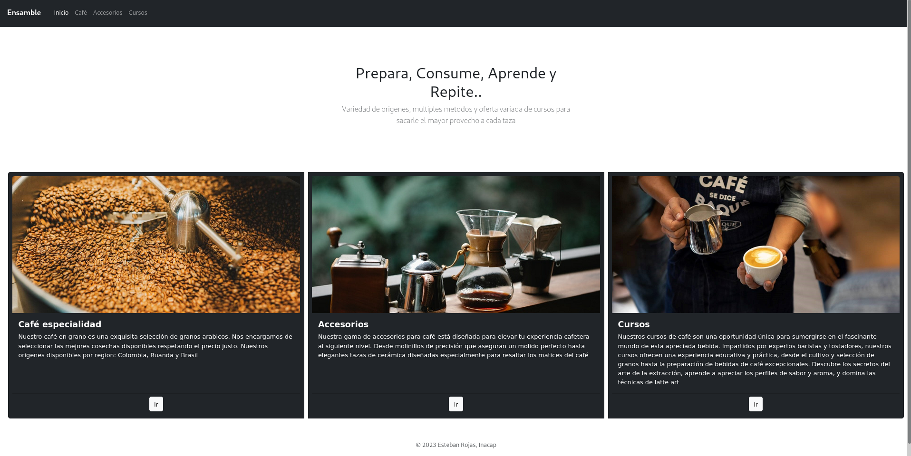
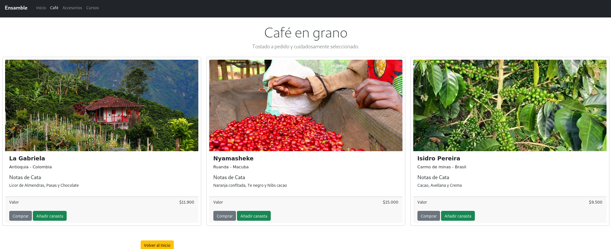
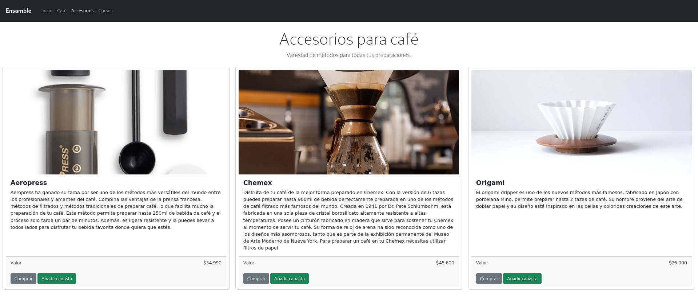
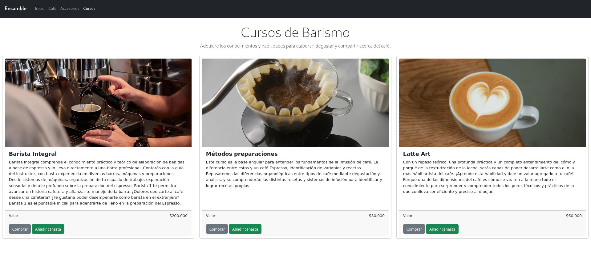
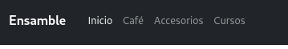
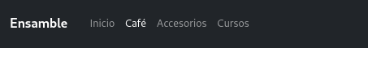
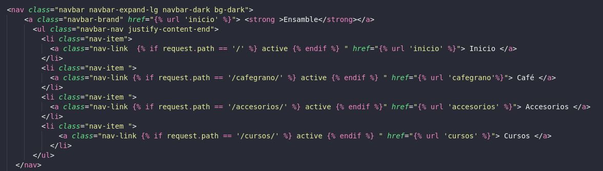
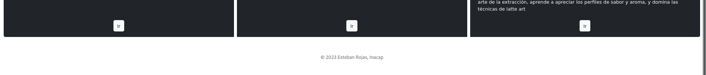
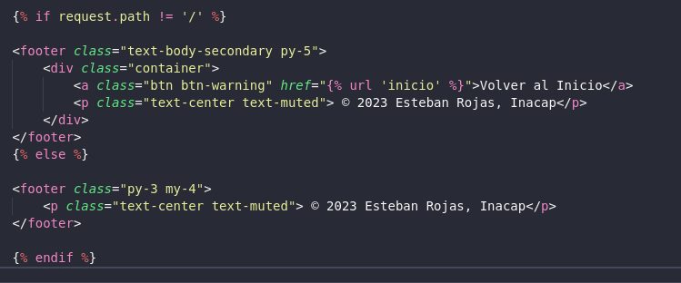

# BackendDjango
Proyecto backend cuatro vistas en Django. 1 inicio 3 productos con 3 items respectivamente . No se utilizo base de datos!.

# Para probar la app

```console
foo@bar:~$ git clone git@github.com:V60cup/BackendDjango.git #Si tienes ssh como preferencia
foo@bar:~$ git clone https://github.com/V60cup/BackendDjango.git #Si tienes https como preferencia

foo@bar:~$ cd BackendDjango
foo@bar:~$ source env/bin/activate 

# En caso de que no quieras usar el ambiente de desarrollo , puedes instalar todo desdej
foo@bar:~$ pip install -r requirements.txt

```


# Caracteristicas 

### Inicio

### Producto: Cafe

### Producto: Accesorios

### Producto: Cursos


## Detalles de diseño

### sitio actual destaca en nav bar



Esto se logro a partir del siguiente codigo. Tanto lo que se hizo en el nav como en el footer, fue una buena instancia para entende más sobre estructuras de control en jinja


### boton volver en sitios distintos a inicio



Esto se logro a partir del siguiente codigo. 

